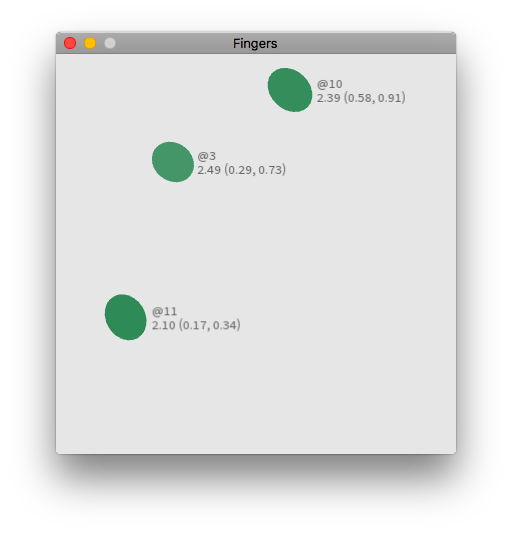

## MTIF Examples

These examples don't have ASDF definitions - just `LOAD` them into your lisp
image and evaluate `(run)` in the example package.

### one.lisp

This uses [Sketch](https://github.com/vydd/sketch) to visualise your fingers.
